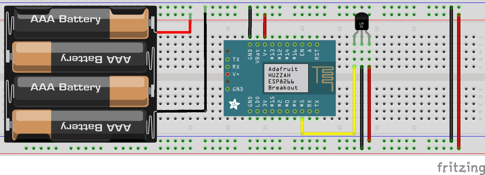

# ESP Temperature and Humidity Sensors

## Hardware
* ESP (32 or 8266 )
* DHT11 Sensor
* Soldering Kit, wires
* Power ( usb power-supply or battery )
* Mini USB cable

## Software
* Arduino IDE
  * Arduino Libraries
    * Adafruit Unified Sensor
    * DHT Sensor Library for ESx

## Steps
* Install Arduino
* Install Arduino Libraries
* Load the Code
* Change the Code Variables at the beggining of the code
* Prepare the Hardware based on Image
* Scan your Wifi look for the ESP network 
  * connect and browse to 192.168.4.1
  * Configure the network you want to connect

## To-Dos
- [x] Sensor Calibration Hardcodes
- [ ] Sensor Calibration Frontend
- [x] API calls on all components and configs
- [x] Wifi Manager for choosing the WIFI
- [ ] Assign IP directly from the Wifi manager

## Big Thanks 
* https://github.com/bblanchon/ArduinoJson
* https://github.com/tzapu/WiFiManager/
* https://randomnerdtutorials.com/esp8266-dht11dht22-temperature-and-humidity-web-server-with-arduino-ide/

## Some Photos

