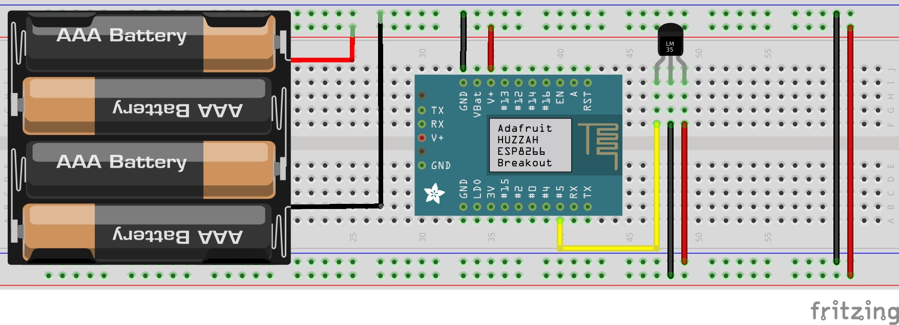
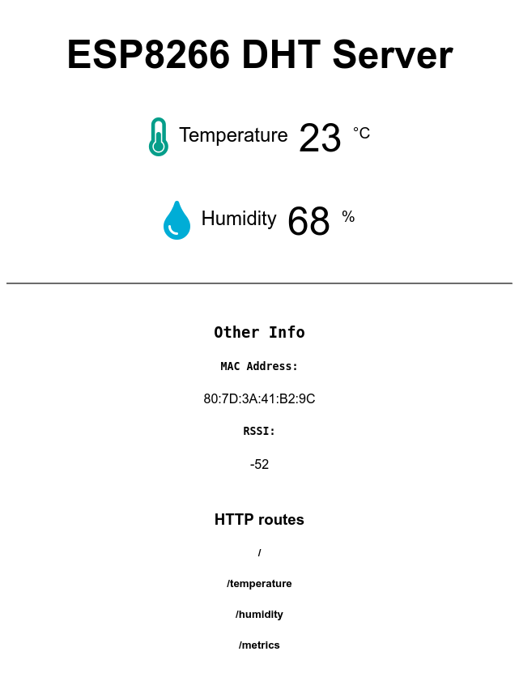
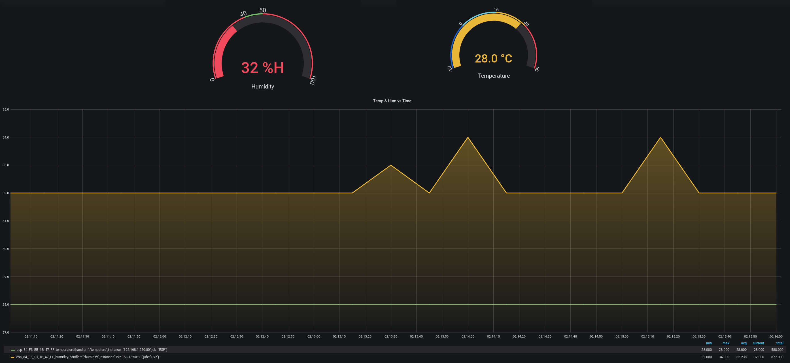

[![Contributors][contributors-shield]][contributors-url]
[![Forks][forks-shield]][forks-url]
[![Stargazers][stars-shield]][stars-url]
[![Issues][issues-shield]][issues-url]
[![GPL3 License][license-shield]][license-url]
[![LinkedIn][linkedin-shield]][linkedin-url]
[![Ask Me Anything][ask-me-anything]][personal-page]

<!-- PROJECT LOGO -->
 

  

  <h3 align="center">[ESP Temperature and Humidity Sensors</h3>

  

    Monitor temperature, Humidity and Barometric Presure with Arduino in Grafana 
     
    <a href="./README.md"><strong>Explore the docs »</strong></a>
     
     
    <!--<a href="https://github.com/stiliajohny/esp-temperature-humidity-in-grafana">View Demo</a>
    · -->
    <a href="https://github.com/stiliajohny/esp-temperature-humidity-in-grafana/issues/new?labels=i%3A+bug&template=1-bug-report.md">Report Bug</a>
    ·
    <a href="https://github.com/stiliajohny/esp-temperature-humidity-in-grafana/issues/new?labels=i%3A+enhancement&template=2-feature-request.md">Request Feature</a>
  

<!-- TABLE OF CONTENTS -->

## Table of Contents

- [About the Project](#about-the-project)
  - [Built With](#built-with)
- [Getting Started](#getting-started)
  - [Prerequisites](#prerequisites)
  - [Installation](#installation)
- [Usage](#usage)
- [Roadmap](#roadmap)
- [Contributing](#contributing)
- [License](#license)
- [Contact](#contact)
- [Acknowledgements](#acknowledgements)

<!-- ABOUT THE PROJECT -->

## About The Project

This is a custom Prometheus metrics server embended on an ESP.
It utilises a DHT sensor ( or any other prefered sensor ) to capture Temperature, Humidity and Barometric Presure data.
The data are visible via REST API as well as Frontend

### Built With

##### Hardware

- ESP (32 or 8266 )
- DHT11 Sensor
- Soldering Kit, wires
- Power ( usb power-supply or battery )
- Mini USB cable

##### Software

- Arduino IDE
  - Arduino Libraries
    - Adafruit Unified Sensor
    - DHT Sensor Library for ESx

---

<!-- GETTING STARTED -->

## Getting Started

- Install Arduino
- Install Arduino Libraries
- Load the Code
- Change the Code Variables at the beggining of the code
- Prepare the Hardware based on Image
- Scan your Wifi look for the ESP network
  - connect and browse to 192.168.4.1
  - Configure the network you want to connect

### Prerequisites

- Arduino IDE
- Arduino Libraries
  - ESP
  - Temperature sendor ( DTH inthis case )

### Installation

## Usage

After pushing the code on the ESP and configureing the wifi, edit your prometheus configuration file to include the IP of the ESP

---

<!-- ROADMAP -->

## Roadmap

See the [open issues](https://github.com/stiliajohny/esp-temperature-humidity-in-grafana/issues) for a list of proposed features (and known issues).

---

<!-- CONTRIBUTING -->

## Contributing

Contributions are what make the open source community such an amazing place to be learn, inspire, and create. Any contributions you make are **greatly appreciated**.

1. Fork the Project
2. Create your Feature Branch (`git checkout -b feature/AmazingFeature`)
3. Commit your Changes (`git commit -m 'Add some AmazingFeature'`)
4. Push to the Branch (`git push origin feature/AmazingFeature`)
5. Open a Pull Request

---

<!-- LICENSE -->

## License

Distributed under the GPL-3.0 License. See `LICENSE` for more information.

<!-- CONTACT -->

## Contact

Your Name - [@john_stilia](https://twitter.com/john_stilia) - stilia.johny@gmail.com

<!--
Project Link: [https://github.com/your_username/repo_name](https://github.com/your_username/repo_name)
-->

---

<!-- ACKNOWLEDGEMENTS -->

## Acknowledgements

- [GitHub Emoji Cheat Sheet](https://www.webpagefx.com/tools/emoji-cheat-sheet)
- [Img Shields](https://shields.io)
- [Choose an Open Source License](https://choosealicense.com)
- [GitHub Pages](https://pages.github.com)

<!-- MARKDOWN LINKS & IMAGES -->
<!-- https://www.markdownguide.org/basic-syntax/#reference-style-links -->

[contributors-shield]: https://img.shields.io/github/contributors/stiliajohny/esp-temperature-humidity-in-grafana.svg?style=for-the-badge
[contributors-url]: https://github.com/stiliajohny/esp-temperature-humidity-in-grafana/graphs/contributors
[forks-shield]: https://img.shields.io/github/forks/stiliajohny/esp-temperature-humidity-in-grafana.svg?style=for-the-badge
[forks-url]: https://github.com/stiliajohny/esp-temperature-humidity-in-grafana/network/members
[stars-shield]: https://img.shields.io/github/stars/stiliajohny/esp-temperature-humidity-in-grafana.svg?style=for-the-badge
[stars-url]: https://github.com/stiliajohny/esp-temperature-humidity-in-grafana/stargazers
[issues-shield]: https://img.shields.io/github/issues/stiliajohny/esp-temperature-humidity-in-grafana.svg?style=for-the-badge
[issues-url]: https://github.com/stiliajohny/esp-temperature-humidity-in-grafana/issues
[license-shield]: https://img.shields.io/github/license/stiliajohny/esp-temperature-humidity-in-grafana?style=for-the-badge
[license-url]: https://github.com/stiliajohny/esp-temperature-humidity-in-grafana/blob/master/LICENSE.txt
[linkedin-shield]: https://img.shields.io/badge/-LinkedIn-black.svg?style=for-the-badge&logo=linkedin&colorB=555
[linkedin-url]: https://linkedin.com/in/johnstilia/
[product-screenshot]: .assets/screenshot.png
[ask-me-anything]: https://img.shields.io/badge/Ask%20me-anything-1abc9c.svg?style=for-the-badge
[personal-page]: https://github.com/stiliajohny
